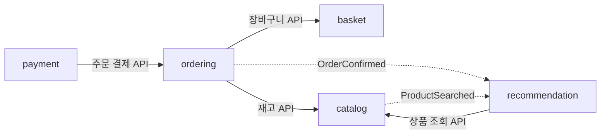
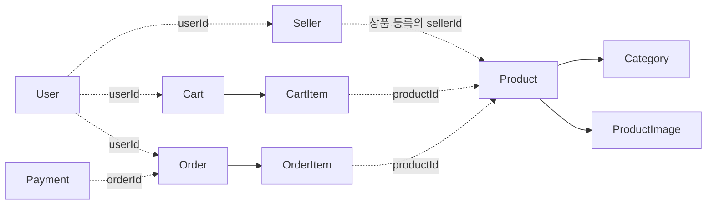

# Pagopa

상품 조회, 장바구니, 주문·취소, 결제와 상품 추천을 구현하는 이커머스 백엔드 프로젝트입니다. 주문·결제·재고의 상태와 트랜잭션 경계, 도메인별 모듈 협력, 이벤트 중복 처리를 중심으로 개발하고 있습니다.

- 개발 기간: 2026.03~진행 중
- 개발 형태: 개인 프로젝트
- 문서 확인 기준: 2026.10.10
- [대상 테스트 실행 결과](docs/validation.md): 동시성 12개를 포함한 28개 테스트 통과

## 구현 기능

| 영역 | 주요 기능 |
| --- | --- |
| 인증 | Spring Security, OAuth2 로그인, JWT 인증·토큰 재발급, 역할별 접근 제어 |
| 상품·판매자 | 상품 조회·검색, 판매자 상품 관리, 카테고리·상품 이미지 관리 |
| 장바구니·주문 | 장바구니 및 상품 바로 주문, 주문 항목·배송 정보, 주문 취소와 재고 복구 |
| 결제 | 승인·취소 흐름, 멱등 키, 처리 결과 확인, 내부 테스트 게이트웨이 |
| 추천 | 검색·주문 확정 이벤트를 통한 관심도 집계와 상품 추천 |
| 이미지 | 공통 이미지 서비스와 Azure Blob·Supabase Storage 구현체 |

결제 게이트웨이는 현재 `local`, `test` 프로필의 내부 구현체로 검증합니다. 실제 결제 사업자와의 승인·취소 연동 완료를 뜻하지 않습니다.

## 기술 스택

| 구분 | 기술 |
| --- | --- |
| 런타임·프레임워크 | Java 25, Spring Boot 4.0.4, Spring Modulith 2.0.8 |
| 인증·데이터 접근 | Spring Security, OAuth2, JWT, JPA, QueryDSL |
| 데이터베이스·마이그레이션 | MySQL, Flyway |
| 검증 | JUnit, Testcontainers, Spring Modulith 모듈 검증 |
| 이미지 저장소 | Azure Blob Storage, Supabase Storage의 S3 API(AWS SDK for Java) |
| 개발·운영 도구 | Gradle Wrapper 9.4.0, Docker, GitHub Actions, Swagger, Prometheus, Grafana, EFK Stack |

저장소 구현체는 `app.storage.provider.type` 설정으로 선택합니다. Supabase 구현체는 S3 호환 API를 호출하며, [지원되는 S3 API](https://supabase.com/docs/guides/storage/s3/compatibility)를 기준으로 사용합니다. 실제 클라우드 업로드·삭제는 아래 대상 테스트의 검증 범위에 포함되지 않습니다.

## 모듈 구조

애플리케이션은 하나의 Spring Boot 프로세스 안에서 도메인별 모듈을 분리합니다. 다른 도메인과의 협력에는 공개 API와 이벤트를 사용하며, 모듈 의존 관계를 테스트로 검사합니다.

| 모듈 | 책임 |
| --- | --- |
| `identity` | 사용자·역할·인증 |
| `catalog` | 상품·카테고리·재고 |
| `merchant` | 판매자 |
| `basket` | 장바구니 |
| `ordering` | 주문·주문 항목·취소 |
| `payment` | 결제 요청·승인·취소 |
| `review` | 상품 리뷰 |
| `discovery` | 조회·검색 흐름 |
| `recommendation` | 이벤트 기록·관심도 집계·추천 조회 |
| `media` | 이미지 저장·삭제 |
| `global` | 공통 응답·예외·설정 |

다음은 주문과 추천의 주요 협력 흐름입니다. 전체 모듈 의존 그래프를 대신하지는 않습니다.



## 핵심 데이터 관계

아래 관계도는 엔티티의 주요 연결을 읽기 쉽게 요약한 것입니다. 점선은 ID로 참조하는 모듈 간 관계, 실선은 모듈 내부 JPA 관계를 나타냅니다. 점선 관계에 데이터베이스 외래 키가 존재한다는 뜻은 아닙니다.



상품 등록 흐름에서 전달하는 판매자 ID는 현재 `Product.userId` 필드에 저장됩니다.

주문 항목은 상품 ID와 함께 상품명·주문 가격·수량을 저장합니다. 주문 시점의 정보와 현재 상품 정보를 분리해 표현합니다.

## 주요 설계

### 동시 주문과 재고 복구

상품 재고와 주문 상태 변경에 비관적 잠금을 사용합니다. 여러 상품의 재고를 변경할 때는 상품 ID 순서로 잠금을 획득합니다. 중복 상품 항목은 수량을 합산해 처리합니다.

같은 상품의 동시 주문과 같은 주문의 동시 취소를 비롯한 네 가지 시나리오를 각각 50·200·1,000개 동시 요청으로 실행했습니다. 초과 판매 방지, 한 번만 취소되는 주문, 최종 재고 복구를 검증했습니다. 구체적인 성공 조건은 [검증 기록](docs/validation.md)에 정리했습니다.

### 결제 승인·취소

게이트웨이 호출과 DB 상태 변경의 트랜잭션 경계를 분리하고, 멱등 키와 결과 조회를 사용하도록 구성했습니다. 내부 게이트웨이를 통해 흐름을 구현하며, 실제 결제 사업자 연동 여부와 내부 흐름 검증을 구분합니다.

### 이벤트 기반 추천

상품 검색과 주문 확정 이벤트를 받아 관심도를 갱신합니다. 검색 키워드는 정규화하고, 주문의 상품 ID는 중복을 제거합니다. 현재 검색은 관심도 1, 주문 상품은 관심도 5를 추가합니다.

이벤트 ID 중복 확인과 관심도 갱신을 같은 트랜잭션에서 처리합니다. 이미 처리한 이벤트는 집계를 반복하지 않습니다. 추천 조회는 관심 상품, 관심 키워드의 후보, 기본 상품 순서로 후보를 모으고 중복·비활성·품절 상품을 걸러냅니다.

## 로컬 실행

### 준비 사항

- Java 25 및 프로젝트의 Gradle Wrapper
- 정상 실행 중인 Docker: Testcontainers 검증에 사용
- 로컬 서버 실행 시 접근 가능한 MySQL과 환경 설정

현재 기본 설정은 `spring.jpa.hibernate.ddl-auto=none`입니다. Flyway의 `V1`은 추천 테이블, `V2`는 Modulith 이벤트 발행 테이블을 만듭니다. **사용자·상품·주문 등 나머지 핵심 테이블의 전체 초기화 마이그레이션은 아직 포함되어 있지 않아, 준비된 스키마가 필요합니다.** 빈 DB에 서버 실행 명령만 입력해서 전체 테이블이 생성되는 상태는 아닙니다.

테스트 프로필은 별도의 설정과 Testcontainers를 사용합니다. 기존 서비스 DB를 테스트 DB로 지정할 필요가 없습니다.

### 환경 설정

실제 값은 실행 환경에서 설정합니다. 설정 이름과 기본값의 기준은 `src/main/resources/application.yml`입니다.

| 영역 | 주요 환경 변수 |
| --- | --- |
| DB | `DB_URL`, `DB_USERNAME`, `DB_PASSWORD` |
| JWT | `JWT_SECRET`, `JWT_ACCESS_TOKEN_EXPIRY`, `JWT_REFRESH_TOKEN_EXPIRY` |
| OAuth2 | `GOOGLE_CLIENT_ID`, `GOOGLE_CLIENT_SECRET`, `GOOGLE_ADMIN_CLIENT_ID`, `GOOGLE_ADMIN_CLIENT_SECRET`, `KAKAO_CLIENT_ID`, `KAKAO_CLIENT_SECRET`, `NAVER_CLIENT_ID`, `NAVER_CLIENT_SECRET` |
| 이미지 공통 | `IMAGE_ALLOWED_TYPES`, `IMAGE_MAX_SIZE` |
| Azure 저장소 | `AZURE_STORAGE_ACCOUNT_NAME`, `AZURE_STORAGE_ACCOUNT_KEY`, `AZURE_STORAGE_BASE_URL`, `AZURE_STORAGE_BLOB_ENDPOINT`, `AZURE_STORAGE_CONTAINER_NAME` |
| Supabase 저장소 | `SUPABASE_PROJECT_URL`, `SUPABASE_STORAGE_ACCESS_KEY`, `SUPABASE_STORAGE_SECRET_KEY`, `SUPABASE_STORAGE_BUCKET`, `SUPABASE_STORAGE_ENDPOINT`, `SUPABASE_STORAGE_REGION` |
| 웹 요청 | `SERVER_PORT`, `CORS_ALLOWED_ORIGINS`, `OAUTH2_REDIRECT_URL` |

저장소를 선택하더라도 현재 설정 빈에는 다른 저장소의 설정을 참조하는 부분이 있으므로, 선택한 저장소의 변수만으로 기동 가능하다고 가정하지 않습니다. 시작 전에 현재 설정 파일의 필수 변수를 확인합니다. 결제·시드·작업 주기 관련 설정도 같은 파일에 있습니다.

스키마와 환경 설정을 준비한 뒤 Windows에서는 다음과 같이 실행합니다.

```powershell
.\gradlew.bat bootRun --args="--spring.profiles.active=local"
```

macOS·Linux에서는 같은 인자에 `./gradlew`를 사용합니다.

### 대상 테스트 실행

2026.10.10에 실제 실행한 Windows 명령입니다.

```powershell
.\gradlew.bat test --tests '*StockConcurrencyTest' --tests '*ApplicationModulithTest' --tests '*RecommendationProjectionServiceTest' --tests '*RecommendationQueryServiceTest' --tests '*RecommendationFlowIntegrationTest' --no-daemon --console=plain
```

결과: **28개 통과, 실패 0개, 오류 0개, 건너뜀 0개**. 전체 테스트 스위트나 실제 HTTP 처리량을 측정한 결과가 아닙니다.

GitHub Actions에는 Java 25 환경의 `./gradlew clean build --no-daemon --stacktrace`가 구성되어 있습니다. 이 문서의 통과 결과는 위 로컬 대상 테스트에서 확인한 내용입니다.
